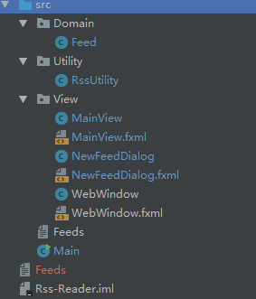
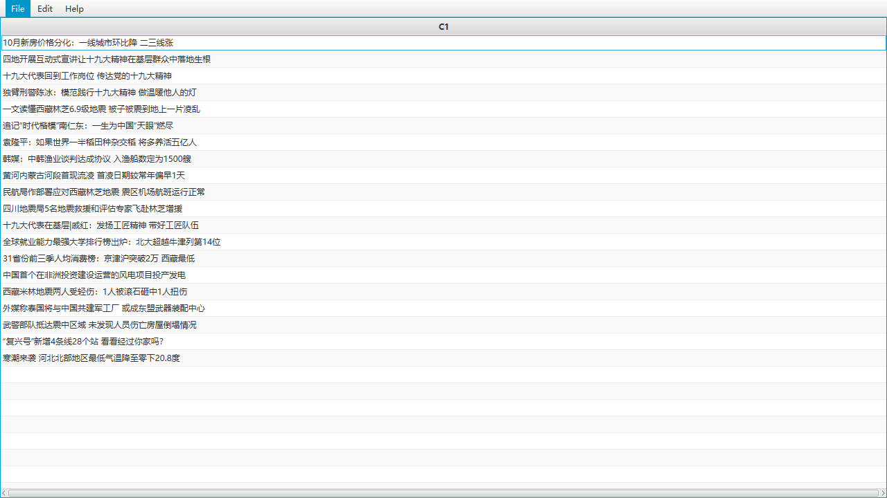
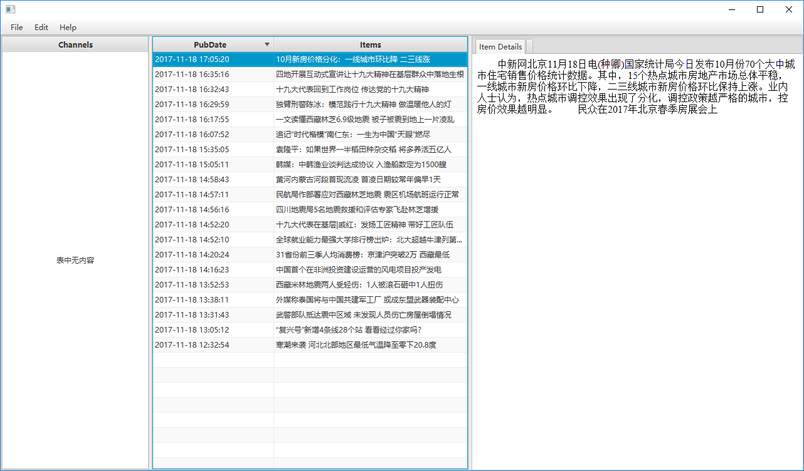
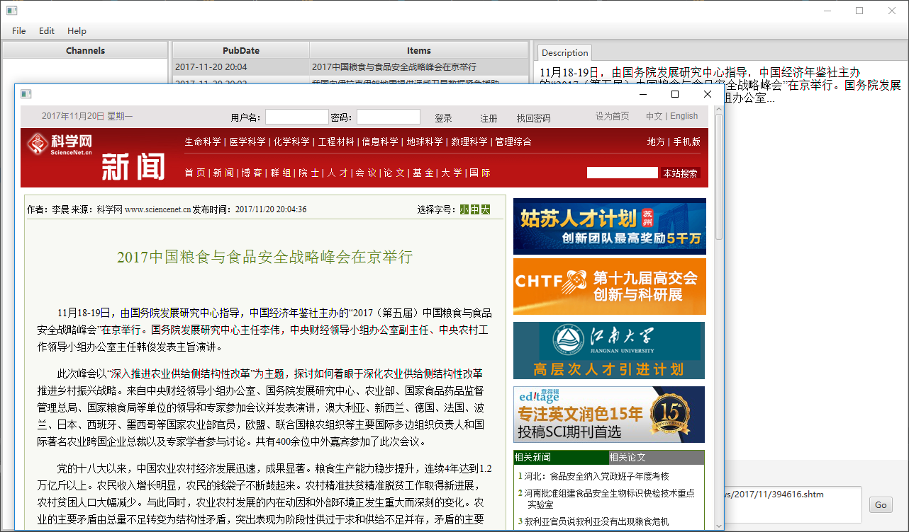

# Rss Reader

@author BJTU-16301130
@date Nov. 2017

***

### Requirenment Analysis
1. GUI
1. Local rss file parsing and display
3. Export rss file
4. Deal with the internet content

***

### Class Design

1. Domain.Feed
    * **Encapsulateded business class** used to store the data of feed url and its channel title
2. Utility.RssUtility
    * Utility class with some **static methods** used to deal with the rss feeds
3. View
    * GUI layout and its cotroller which invokes methods declared in *RssUtility*
4. Main
    * The entry point of the app

***

### Developing Plan
1. A simple parser programme
    * input: url
    * output: xml elements

2. Design the GUI
    * channels->items->description->webview

3. Show a single rss feed and its items in the GUI

4. Enhance the GUI to show the verbose information of the item

5. Open the item link in a webview in a new

6. Deal with multiple feeds
    1. add internet content
    1. record feeds locally
    2. export xml to disk
    2. import xml from disk

6. (Duplicated) record whether the item is read

6. (Duplicated) subsribe the channel and notify when a new item is published

***

### Acceptance Report
* Most functions are well-enough implemented.
Maybe there are limited bugs existing. But it will not bother the usage.

***

### Usage Manual
* It's a really simple Application. Just try the menu items.

***

### Third Party Libraries
[JDOM](http://www.jdom.org/)

***

### Reference

[RSS 2.0 Specification](http://cyber.harvard.edu/rss/rss.html)
[studytrails - Java XML – Example JDOM2 Usage](http://www.studytrails.com/java/xml/jdom2/java-xml-jdom2-example-usage/)
[code.makery - JavaFX 8 Tutorial](http://code.makery.ch/library/javafx-8-tutorial/)
